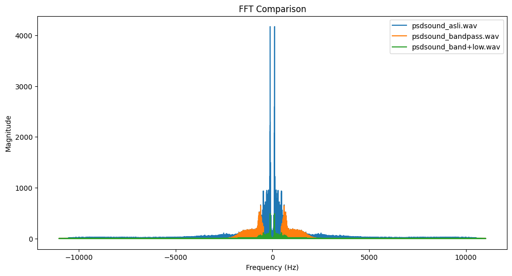
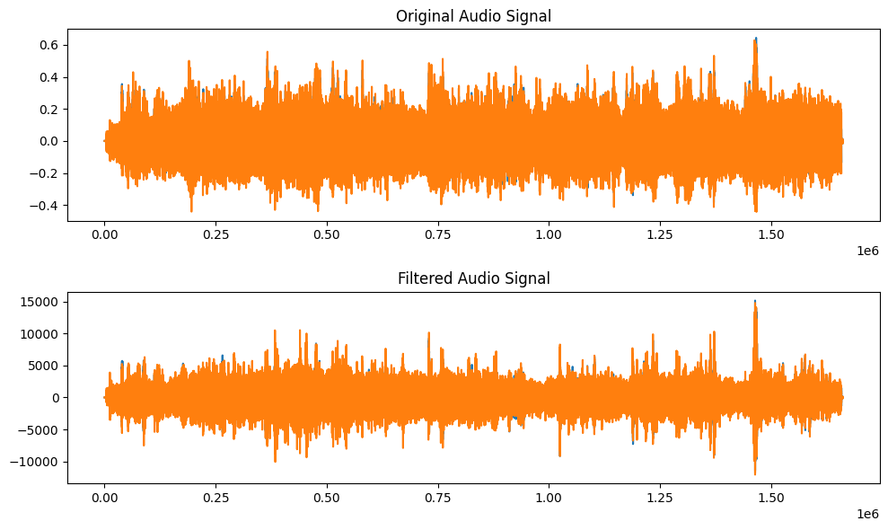
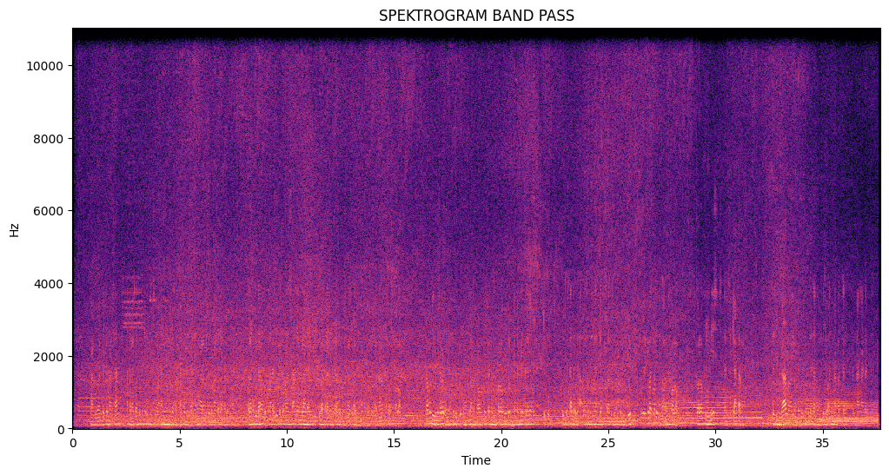
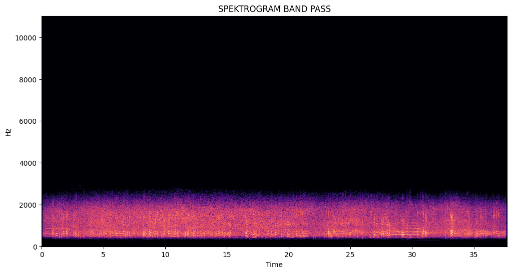
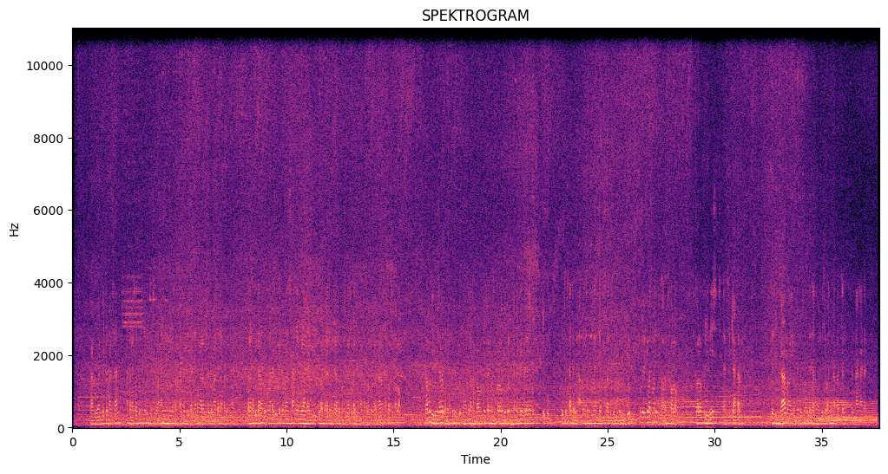

# Filter Suara Keramaian — Pengolahan Sinyal Digital

Project pengolahan sinyal digital untuk memfilter suara keramaian kota menggunakan teknik Band Pass dan Low Pass Filter.

## Latar Belakang
Suara keramaian di tengah kota (lalu lintas, klakson, kebisingan mesin) mengganggu kenyamanan dan berpotensi merusak kesehatan fisik dan mental. Project ini memisahkan komponen frekuensi yang diinginkan (suara manusia, suara alam) dari komponen yang tidak diinginkan (kendaraan bermotor, kebisingan mesin) lewat filtering frekuensi.

## Tujuan
1. Memisahkan suara keramaian menjadi komponen frekuensi yang diinginkan dan tidak diinginkan.
2. Mengurangi/menghilangkan suara yang tidak diinginkan dengan filter frekuensi yang relevan.
3. Meningkatkan kualitas audio dengan menghilangkan gangguan suara keramaian.

## Alur Pengolahan
1. **Load & putar audio** — audio asli (`psdsound_asli.wav`) dimuat dengan `librosa`.
2. **Analisis FFT** — membandingkan spektrum frekuensi audio asli vs hasil filter.
3. **Band Pass Filter** — filter Butterworth untuk melewatkan rentang frekuensi 500–2000 Hz.
4. **Low Pass Filter** — diterapkan setelah band-pass untuk memotong frekuensi di atas cutoff 8000 Hz, menghasilkan `psdsound_band+low.wav`.
5. **Evaluasi SNR** — Signal-to-Noise Ratio dihitung dan dibandingkan antara audio asli, hasil band-pass, dan hasil band-pass+low-pass.
6. **Spektrogram** — visualisasi STFT (Short-Time Fourier Transform) untuk melihat perubahan komposisi frekuensi dari waktu ke waktu.
7. **Penguatan amplitudo** — demonstrasi tambahan mengalikan amplitudo sinyal dengan gain factor.

## Hasil
- Nilai SNR (mean/std) yang dihitung sangat mendekati nol pada ketiga tahap (asli: -0.000186, band pass: 0.0000000878, band pass + low pass: 0.000144). Karena sinyal audio pada dasarnya zero-mean, metrik SNR sederhana ini kurang representatif untuk menunjukkan peningkatan kualitas secara kuantitatif — perbandingan kualitas lebih terlihat jelas lewat FFT dan spektrogram di bawah.
- Pada FFT comparison, energi frekuensi di luar rentang 500–2000 Hz (hasil cutoff band pass filter) tampak berkurang signifikan dibanding sinyal asli, menunjukkan filter berhasil membuang komponen frekuensi rendah dan tinggi yang mewakili kebisingan (mis. dengungan mesin frekuensi rendah, desis frekuensi tinggi). Setelah ditambah low pass filter (cutoff 8000 Hz), komponen frekuensi tinggi tersisa semakin terpangkas.
- Spektrogram audio asli menunjukkan energi tersebar di hampir seluruh rentang frekuensi sepanjang waktu (indikasi noise broadband). Setelah band pass, energi lebih terkonsentrasi di pita 500–2000 Hz. Setelah ditambah low pass, komponen frekuensi tinggi di atas 8000 Hz semakin meredup, menyisakan pita frekuensi yang lebih fokus pada rentang suara yang diinginkan.

## Visualisasi






## Tools
Python, NumPy, SciPy (signal processing, Butterworth filter), Librosa, Matplotlib

## Struktur Folder
```
Pengolahan-Sinyal-Digital/
├── PSD-FINAL.ipynb
├── psdsound_asli.wav
├── psdsound_bandpass.wav
├── psdsound_band+low.wav
├── images/
├── requirements.txt
└── README.md
```
